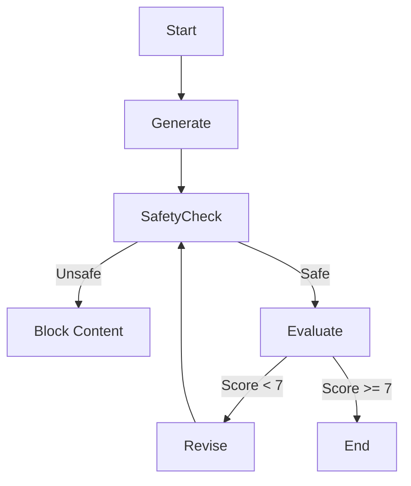

# AI Agent Assignment Submission

## Part 1: Problem Selection

### The Specific Problem
Small business owners often struggle to maintain a consistent social media presence. They face "writer's block," lack marketing expertise to craft engaging captions, and fear accidentally posting content that might violate platform policies or damage their brand (e.g., making unverified medical claims).

### Why this is suitable for an AI Agent
This problem is ideal for an AI agent because:
1.  **Generative Capability**: LLMs excel at creative writing and adapting to specific tones.
2.  **Rule-Based Logic**: Safety guidelines (e.g., "no medical claims") can be strictly enforced via prompt engineering and guardrails.
3.  **Iterative Process**: Writing often requires valid revisions, which an agentic workflow (Draft -> Critique -> Refine) handles perfectly.

### End User
A small business owner (e.g., cafe owner, boutique shop manager) with limited time and no dedicated marketing team.

### Success Metric
The user inputs a raw idea (e.g., "sell more coffee") and receives a **safe, high-quality, ready-to-post** Instagram caption with relevant hashtags in under 30 seconds.

---

## Part 2: Agent Design

### Goal
To autonomously generate, evaluate, and refine social media posts that adhere to strict safety and quality standards.

### Inputs & Outputs
-   **Inputs**: Business Name, Category, Tone (e.g., "Witty"), Offer Description.
-   **Outputs**: Final Text Caption, Quality Score (0-10), Safety Status (Pass/Fail).

### Tools Used
1.  **LLM (OpenAI GPT-3.5/4o)**: For generation and evaluation.
2.  **File System (JSON)**: For long-term memory persistence.
3.  **Regex**: For evaluating hard constraints (word count, hashtag count).

### Memory Strategy
-   **Short-term (State)**: Uses `revision_count` to track the current session and prevent infinite loops.
-   **Long-term (JSON)**: Stores **Brand Tone** and **Used Hashtags**. This allows the agent to "learn" the business's style and hashtag preferences over time, improving relevance with every use.

### Failure Handling
1.  **Unsafe Content**: If the `safety_check` node flags content (e.g., medical claims), the workflow **immediately acts** to block the content and returns a safe fallback message, preventing the user from ever seeing harmful output.
2.  **Low Quality**: If the post scores < 7/10, the agent enters a **Revision Loop**.
3.  **Infinite Loops**: A hard limit of **2 revisions** is set. If the post still isn't perfect, the agent returns the best available version to ensure the process always terminates.

### Diagram (Mental Model)

---

## Part 3: Minimal Implementation

The implementation uses **LangGraph** to orchestrate a stateful workflow.

### Core Logic (Python/LangGraph)

The solution is implemented in `graph.py` and visualized via `app.py`.

**Key Workflow Steps:**
1.  **Generate**: Creates a draft using the user's input + long-term memory (tone/hashtags).
2.  **Safety Guard**: A dedicated LLM call checks for policy violations.
3.  **Evaluate**: Uses a "Critic" prompt to score engagement and check constraints (Word count < 150).
4.  **Loop**: If requirements aren't met, the `revise_post` node rewrites the content based on specific feedback.

*See `marketing_agent/graph.py` for the complete production-ready code.*

---

## Part 4: Reflection

### 1. Most Fragile Parts
The **Evaluation Node** is the most fragile. Since we use the same model family (GPT) to both write and grade, it may have a bias towards its own writing style. A stricter, rule-based evaluator or a different model for the critic would improve objectivity.

### 2. Intentional Non-Automation
I intentionally did **NOT** automate the **final posting to Instagram**.
*Reasoning*: AI can hallucinate or misinterpret context. A "human-in-the-loop" is critical for the final approval step to prevent potential PR disasters. The agent prepares the draft, but the human pushes the button.

### 3. Improvements (Next 30 Days)
1.  **Multi-Modal**: Add an image generation node (DALL-E 3) to create visuals matching the caption.
2.  **Analytics Feedback**: Connect to Instagram Insights API. If a post gets high engagement, update the "Long-Term Memory" to prioritize similar styles/hashtags.
3.  **Scheduling**: Allow the user to "Approve & Schedule" directly from the UI.
